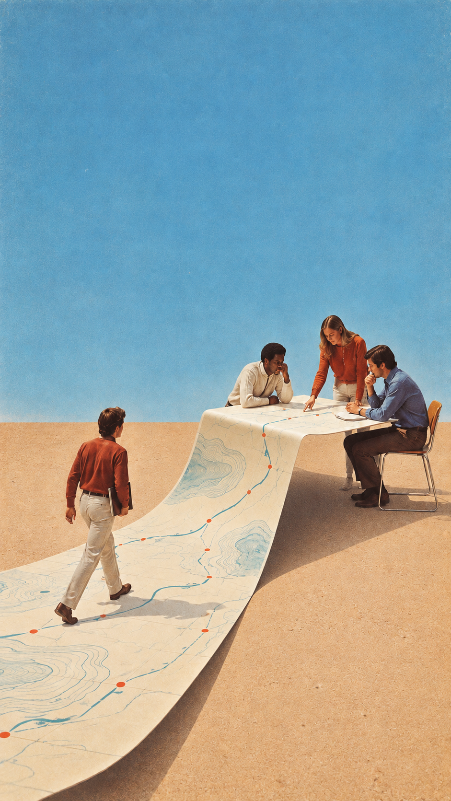

# 已认可样例与修正经验

## TS-001 地图成为工作台

用户明确评价生图风格“很好，我很喜欢”。图像把地图连续卷成团队工作台，将外部寻找与内部协作连起来。可复用：明亮青蓝与暖纸色、摄影拼贴、自然动作、连续空间隐喻与留白。不复用：固定四人、地图、沙地或同一布局。

## 第二主题：蓝底环带 demo

文章关注 Function → Loop Owner。用户认为此前的职能工位与工作步骤表达过硬，补充人物与扭转表面、手势与线条两张参考。红底环带版得到“元素设计还可以”的反馈，但背景太红。随后保留元素换柔和灰青蓝＋暖米白，用户反馈：“可以，这个好看的。记录下这个偏好和反馈。”

认可范围：本期元素方向、蓝底配色和视觉观感。不是对标题排版、最终裁切或隐喻准确度的全面验收。大手可能被读成外部控制，下一主题不能机械复制。没有把“环形 = Loop”作为通用答案。

明确通用要求：用户新参考只借元素与关系，不借背景配色，除非明确要求。使用意象关系，不把内容逐项翻译成流程图。先展示提案获确认，再生图；统一无字背景。

## 本蓝底版实际编辑指令

以前一张红底图为编辑目标：只把背景（含环内空洞）换成柔和明亮灰青蓝；保留暖米白带面、深色线条、行走者和手势、主体位置、留白；无新物件无文字。工具为内置 imagegen。实际输出保留了主要构图，但纹理也有变化，不声称像素级仅换色。历史失败图未收入此发行包。
